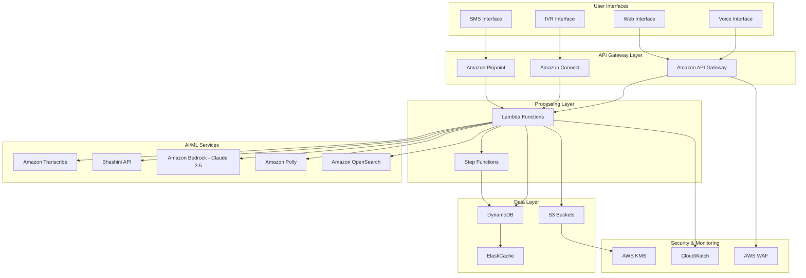

# Design Document: SarkariSaathi

## Overview

SarkariSaathi is a serverless, voice-first AI assistant built on AWS that helps Indian citizens discover and apply for government schemes. The system leverages a multilingual pipeline combining Bhashini APIs, Amazon Transcribe, Claude 3.5 Sonnet, and Amazon Polly to provide accessible government services through voice interaction, SMS, and IVR channels.

The architecture follows AWS Well-Architected Framework principles with emphasis on cost optimization, security, reliability, and performance efficiency suitable for a government-scale solution serving diverse Indian demographics.

## Architecture

### High-Level Architecture



### Serverless Architecture Benefits

- **Cost Optimization**: Pay-per-use model ideal for variable government service demand
- **Scalability**: Automatic scaling to handle peak loads during scheme announcements
- **Reliability**: Built-in redundancy and fault tolerance across AWS regions
- **Security**: Managed security services with government compliance standards
- **Maintenance**: Reduced operational overhead for government IT teams

## Components and Interfaces

### 1. Voice Processing Pipeline

**Amazon Transcribe + Bhashini Integration**

- **Primary**: Amazon Transcribe for English and Hindi (Free Tier: 60 minutes/month)
- **Secondary**: Bhashini API for 22+ Indian languages
- **Fallback**: Custom speech models for regional dialects
- **Interface**: RESTful API with WebSocket support for real-time streaming

```typescript
interface VoiceProcessingRequest {
  audioData: Buffer;
  language: string;
  userId: string;
  sessionId: string;
}

interface VoiceProcessingResponse {
  transcription: string;
  confidence: number;
  language: string;
  processingTime: number;
}
```

### 2. Natural Language Understanding

**Amazon Bedrock with Claude 3.5 Sonnet**

- **Model**: Claude 3.5 Sonnet for reasoning and conversation
- **Context**: Government scheme knowledge base
- **Prompt Engineering**: Specialized prompts for scheme discovery and eligibility
- **Rate Limiting**: Token-based throttling for cost control

```typescript
interface NLURequest {
  text: string;
  context: UserContext;
  intent: string;
  language: string;
}

interface NLUResponse {
  intent: string;
  entities: Entity[];
  response: string;
  confidence: number;
  suggestedActions: Action[];
}
```

### 3. Text-to-Speech Pipeline

**Amazon Polly + Bhashini TTS**

- **Primary**: Amazon Polly for English and Hindi neural voices
- **Secondary**: Bhashini TTS for regional languages
- **Optimization**: Audio caching in S3 for common responses
- **Format**: MP3 with 22kHz sampling for voice quality

```typescript
interface TTSRequest {
  text: string;
  language: string;
  voice: string;
  speed: number;
}

interface TTSResponse {
  audioUrl: string;
  duration: number;
  format: string;
  cacheKey: string;
}
```

### 4. RAG-Based Eligibility Engine

**Amazon OpenSearch + Bedrock Knowledge Base**

- **Vector Store**: OpenSearch for semantic search of scheme documents
- **Embeddings**: Amazon Titan Embeddings for document vectorization
- **Retrieval**: Hybrid search combining keyword and semantic matching
- **Knowledge Base**: Government scheme PDFs, eligibility criteria, application forms

```typescript
interface EligibilityQuery {
  userProfile: UserProfile;
  query: string;
  filters: SchemeFilter[];
}

interface EligibilityResponse {
  schemes: Scheme[];
  eligibilityScore: number;
  requiredDocuments: Document[];
  applicationSteps: Step[];
}
```

### 5. SMS/IVR Bridge for Feature Phones

**Amazon Connect + Pinpoint Integration**

- **IVR Flow**: Amazon Connect for voice call handling
- **SMS Gateway**: Amazon Pinpoint for bidirectional SMS
- **DTMF Support**: Touch-tone navigation for basic phones
- **Callback System**: Scheduled callbacks for application follow-ups

```typescript
interface SMSRequest {
  phoneNumber: string;
  message: string;
  language: string;
  userId?: string;
}

interface IVRSession {
  callId: string;
  phoneNumber: string;
  currentStep: string;
  userInputs: Record<string, any>;
  language: string;
}
```

### 6. Application Tracking System

**DynamoDB Schema Design**

- **User Table**: Partition key: userId, GSI on phoneNumber
- **Applications Table**: Partition key: applicationId, GSI on userId
- **Schemes Table**: Partition key: schemeId, GSI on category
- **Sessions Table**: Partition key: sessionId, TTL for cleanup

```typescript
interface UserProfile {
  userId: string;
  phoneNumber: string;
  preferredLanguage: string;
  demographics: Demographics;
  eligibleSchemes: string[];
  applications: ApplicationSummary[];
  createdAt: string;
  updatedAt: string;
}

interface Application {
  applicationId: string;
  userId: string;
  schemeId: string;
  status: ApplicationStatus;
  formData: Record<string, any>;
  documents: DocumentReference[];
  submittedAt?: string;
  trackingNumber?: string;
}
```

## Data Models

### Core Entities

**User Demographics**

```typescript
interface Demographics {
  age: number;
  gender: string;
  state: string;
  district: string;
  income: number;
  category: string; // General, OBC, SC, ST
  occupation: string;
  education: string;
  familySize: number;
  hasDisability: boolean;
}
```

**Government Scheme**

```typescript
interface Scheme {
  schemeId: string;
  name: Record<string, string>; // Multi-language names
  description: Record<string, string>;
  eligibilityCriteria: EligibilityCriteria;
  benefits: Benefit[];
  applicationProcess: ApplicationStep[];
  requiredDocuments: Document[];
  deadlines: Deadline[];
  contactInfo: ContactInfo;
  category: string;
  launchingAuthority: string;
}
```

**Eligibility Criteria**

```typescript
interface EligibilityCriteria {
  ageRange: { min: number; max: number };
  incomeRange: { min: number; max: number };
  allowedStates: string[];
  allowedCategories: string[];
  requiredOccupations: string[];
  excludedOccupations: string[];
  additionalCriteria: CriteriaRule[];
}
```

## Correctness Properties

_A property is a characteristic or behavior that should hold true across all valid executions of a system—essentially, a formal statement about what the system should do. Properties serve as the bridge between human-readable specifications and machine-verifiable correctness guarantees._

### Property Reflection

After analyzing all acceptance criteria, several properties can be consolidated to eliminate redundancy:

- Speech processing properties (1.1, 1.3, 1.4) can be combined into comprehensive audio processing validation
- Language support properties (2.1, 2.2, 2.5) can be unified into multilingual capability testing
- Eligibility engine properties (3.1, 3.3, 4.1, 4.5) can be consolidated into comprehensive eligibility assessment
- Data security properties (6.4, 9.2, 9.3) can be combined into unified security validation
- Performance properties (10.1, 10.2, 10.5) can be integrated into comprehensive performance testing

### Core Properties

**Property 1: Speech Recognition Accuracy**
_For any_ audio input in supported languages with varying noise levels and speech patterns, the Voice_Assistant should achieve at least 95% transcription accuracy and handle pauses appropriately
**Validates: Requirements 1.1, 1.3, 1.4**

**Property 2: Multilingual Processing**
_For any_ text or audio input in supported Indian languages (including code-mixed content), the Language_Processor should correctly detect the language, process the content, and respond in the appropriate language
**Validates: Requirements 2.1, 2.2, 2.5**

**Property 3: Text-to-Speech Quality**
_For any_ text response in supported languages, the Audio_Interface should generate natural-sounding speech in the user's preferred language with consistent quality
**Validates: Requirements 1.2**

**Property 4: Comprehensive Eligibility Assessment**
_For any_ user demographic profile, the Eligibility_Engine should identify all applicable schemes, ask only necessary questions, and reassess eligibility when profile information changes
**Validates: Requirements 3.1, 3.3, 4.1, 4.5**

**Property 5: Scheme Categorization and Filtering**
_For any_ scheme category request, the Eligibility_Engine should return only schemes matching the specified category with proper prioritization
**Validates: Requirements 3.5**

**Property 6: Error Handling and Alternatives**
_For any_ ineligible user profile or failed operation, the system should provide clear explanations and suggest appropriate alternatives or fallback options
**Validates: Requirements 1.5, 4.3, 7.4**

**Property 7: Application Process Completeness**
_For any_ government scheme application, the Application_Assistant should provide complete document lists, deadline warnings, and submission confirmation
**Validates: Requirements 5.1, 5.4, 5.5**

**Property 8: User Profile Management**
_For any_ user interaction, the User_Profile should securely store information, enable recognition on return visits, and allow complete data deletion upon request
**Validates: Requirements 6.1, 6.2, 6.5**

**Property 9: Data Security and Encryption**
_For any_ personal information handled by the system, all data should be encrypted using government-approved standards and transmitted securely
**Validates: Requirements 6.4, 9.2, 9.3**

**Property 10: Government API Integration**
_For any_ government database interaction, the system should use real-time data when available, fall back to cached data with staleness notifications, and provide manual alternatives when APIs fail
**Validates: Requirements 7.1, 7.2, 7.4**

**Property 11: Accessibility Support**
_For any_ user with disabilities or limited technology access, the system should provide appropriate accommodations including text alternatives, slower speech processing, and basic phone compatibility
**Validates: Requirements 8.1, 8.2, 8.3**

**Property 12: Performance and Reliability**
_For any_ user query during business hours, the system should respond within 3 seconds for simple queries, handle overload gracefully with queue management, and maintain 99.5% uptime
**Validates: Requirements 10.1, 10.2, 10.5**

**Property 13: Privacy and Consent Management**
_For any_ personal data collection or sharing, the system should obtain explicit consent, provide clear explanations, and respond to data access requests within 30 days
**Validates: Requirements 9.1, 9.5**

**Property 14: Automatic Scheme Updates**
_For any_ new government scheme announcement, the Scheme_Database should automatically incorporate the scheme within 24 hours and notify relevant users
**Validates: Requirements 3.4, 7.5**

## Error Handling

### Error Categories and Responses

**1. Speech Recognition Errors**

- **Low Confidence**: Request user to repeat with clearer speech
- **Unsupported Language**: Inform user and suggest closest supported alternative
- **Audio Quality Issues**: Provide tips for better audio input
- **Timeout**: Gracefully end session with callback option

**2. API Integration Errors**

- **Government API Failures**: Fall back to cached data with staleness warning
- **Bhashini API Errors**: Fall back to Amazon Transcribe/Polly
- **Rate Limiting**: Queue requests with estimated wait times
- **Authentication Failures**: Retry with exponential backoff

**3. Data Processing Errors**

- **Invalid User Input**: Provide specific guidance for correction
- **Missing Required Information**: Guide user through data collection
- **Eligibility Calculation Errors**: Provide manual review option
- **Database Errors**: Graceful degradation with offline capabilities

**4. System-Level Errors**

- **Lambda Timeouts**: Implement circuit breakers and retries
- **DynamoDB Throttling**: Implement exponential backoff
- **S3 Access Errors**: Use multiple availability zones
- **Network Connectivity**: Offline mode with sync when available

### Error Recovery Strategies

```typescript
interface ErrorRecovery {
  errorType: string;
  retryStrategy: RetryStrategy;
  fallbackAction: FallbackAction;
  userNotification: NotificationStrategy;
  escalationPath: EscalationPath;
}
```

## Testing Strategy

### Dual Testing Approach

The system requires both unit testing and property-based testing for comprehensive coverage:

**Unit Tests**: Focus on specific examples, edge cases, and integration points

- API endpoint validation with known inputs
- Error condition handling with specific scenarios
- Integration between AWS services
- SMS/IVR flow validation with sample conversations

**Property Tests**: Verify universal properties across all inputs

- Speech recognition accuracy across language variations
- Eligibility engine correctness with random demographic profiles
- Data encryption and security across all user interactions
- Performance requirements under various load conditions

### Property-Based Testing Configuration

**Framework**: Use Hypothesis (Python) or fast-check (TypeScript) for property-based testing
**Minimum Iterations**: 100 iterations per property test due to randomization
**Test Tagging**: Each property test must reference its design document property

Tag format: **Feature: sarkari-saathi, Property {number}: {property_text}**

**Example Property Test Structure**:

```python
@given(user_demographics=demographics_strategy())
def test_eligibility_completeness(user_demographics):
    """Feature: sarkari-saathi, Property 4: Comprehensive Eligibility Assessment"""
    eligible_schemes = eligibility_engine.assess(user_demographics)

    # Verify all applicable schemes are identified
    assert all_applicable_schemes_found(eligible_schemes, user_demographics)

    # Verify only necessary questions were asked
    assert questions_are_minimal(eligibility_engine.questions_asked)
```

### AWS Service Testing

**Lambda Functions**: Unit tests with mocked AWS services, integration tests with LocalStack
**DynamoDB**: Property tests for data consistency and performance
**API Gateway**: Load testing for concurrent voice/SMS requests
**Step Functions**: State machine validation with various input scenarios
**Bedrock/OpenSearch**: RAG pipeline accuracy testing with known scheme documents

### Performance Testing

**Load Testing**: Simulate peak government scheme announcement traffic
**Latency Testing**: Verify 3-second response time requirement
**Availability Testing**: Validate 99.5% uptime during business hours
**Cost Testing**: Monitor AWS costs against Free Tier limits

### Security Testing

**Encryption Validation**: Verify KMS encryption for all PII
**Access Control**: Test IAM policies and least privilege access
**Data Privacy**: Validate GDPR/data protection compliance
**Penetration Testing**: Third-party security assessment for government deployment

## AWS Cost Optimization Strategy

### Free Tier Utilization

**Compute Services**

- **Lambda**: 1M free requests/month, 400,000 GB-seconds compute time
- **API Gateway**: 1M API calls/month for REST APIs
- **Step Functions**: 4,000 state transitions/month

**Storage Services**

- **S3**: 5GB standard storage, 20,000 GET requests, 2,000 PUT requests
- **DynamoDB**: 25GB storage, 25 read/write capacity units

**AI/ML Services**

- **Amazon Transcribe**: 60 minutes/month speech-to-text
- **Amazon Polly**: 5M characters/month text-to-speech
- **Amazon Bedrock**: Pay-per-token with Claude 3.5 Sonnet

**Monitoring and Security**

- **CloudWatch**: 10 custom metrics, 5GB log ingestion
- **AWS KMS**: 20,000 requests/month for encryption

### Cost Optimization Techniques

**1. Intelligent Caching Strategy**

```typescript
// Cache frequently requested scheme information
const cacheStrategy = {
  schemeData: "24 hours TTL",
  audioResponses: "7 days TTL",
  userProfiles: "1 hour TTL",
  eligibilityResults: "6 hours TTL",
};
```

**2. Lambda Optimization**

- **Memory Allocation**: Right-size based on actual usage patterns
- **Provisioned Concurrency**: Only for critical voice processing functions
- **ARM Graviton2**: 20% better price performance for compatible workloads

**3. DynamoDB Cost Management**

- **On-Demand Billing**: For unpredictable traffic patterns
- **Global Secondary Indexes**: Minimize to reduce costs
- **Item Size Optimization**: Keep items under 4KB when possible

**4. S3 Storage Classes**

- **Standard**: For active audio files and recent applications
- **Standard-IA**: For older application documents (>30 days)
- **Glacier**: For long-term compliance and audit logs

### Estimated Monthly Costs (Post Free Tier)

**Base Infrastructure**: $50-100/month

- Lambda executions: $20-40
- DynamoDB: $15-25
- S3 storage: $5-10
- API Gateway: $10-20

**AI/ML Services**: $100-300/month

- Amazon Bedrock (Claude): $80-200
- Transcribe/Polly: $20-50
- OpenSearch: $50-100

**Communication Services**: $50-150/month

- Amazon Connect: $30-80
- Pinpoint SMS: $20-70

**Total Estimated**: $200-550/month for moderate usage (1000-5000 users)

### Scaling Considerations

**Traffic Patterns**

- **Peak Hours**: 9 AM - 6 PM IST (business hours)
- **Seasonal Spikes**: Government scheme announcement periods
- **Geographic Distribution**: Higher usage in rural areas during harvest seasons

**Auto-Scaling Configuration**

```yaml
lambda_concurrency:
  voice_processing: 100
  eligibility_engine: 50
  application_assistant: 30

dynamodb_scaling:
  read_capacity: 5-100 (auto-scaling)
  write_capacity: 5-50 (auto-scaling)
```

## Security Architecture

### Data Protection Strategy

**Encryption at Rest**

- **DynamoDB**: Customer-managed KMS keys for user profiles
- **S3**: SSE-KMS for application documents and audio files
- **OpenSearch**: Encryption enabled for scheme knowledge base

**Encryption in Transit**

- **TLS 1.3**: All API communications
- **VPC Endpoints**: Private connectivity to AWS services
- **Certificate Management**: AWS Certificate Manager for SSL/TLS

### Identity and Access Management

**IAM Roles and Policies**

```json
{
  "Version": "2012-10-17",
  "Statement": [
    {
      "Effect": "Allow",
      "Action": ["dynamodb:GetItem", "dynamodb:PutItem", "dynamodb:UpdateItem"],
      "Resource": "arn:aws:dynamodb:*:*:table/SarkariSaathi-*",
      "Condition": {
        "ForAllValues:StringEquals": {
          "dynamodb:Attributes": ["userId", "schemeId", "applicationId"]
        }
      }
    }
  ]
}
```

**API Security**

- **AWS WAF**: Protection against common web exploits
- **API Keys**: Rate limiting and usage tracking
- **Cognito Integration**: User authentication for web interface
- **VPC Security Groups**: Network-level access control

### Compliance and Governance

**Data Residency**: All data stored in AWS Asia Pacific (Mumbai) region
**Audit Logging**: CloudTrail for all API calls and data access
**Data Retention**: Configurable retention policies per data type
**Privacy Controls**: GDPR-compliant data deletion and access procedures

### Monitoring and Alerting

**CloudWatch Dashboards**

- **System Health**: Lambda errors, DynamoDB throttling, API latency
- **Business Metrics**: Application submissions, scheme discoveries, user engagement
- **Cost Monitoring**: Daily spend tracking with budget alerts

**Alerting Strategy**

```typescript
const alerts = {
  criticalErrors: "Immediate SMS/Email",
  performanceDegradation: "5-minute email",
  costThresholds: "Daily budget reports",
  securityEvents: "Immediate escalation",
};
```

This serverless architecture provides a scalable, cost-effective foundation for SarkariSaathi that can handle the diverse needs of Indian citizens while maintaining government-grade security and compliance standards.
